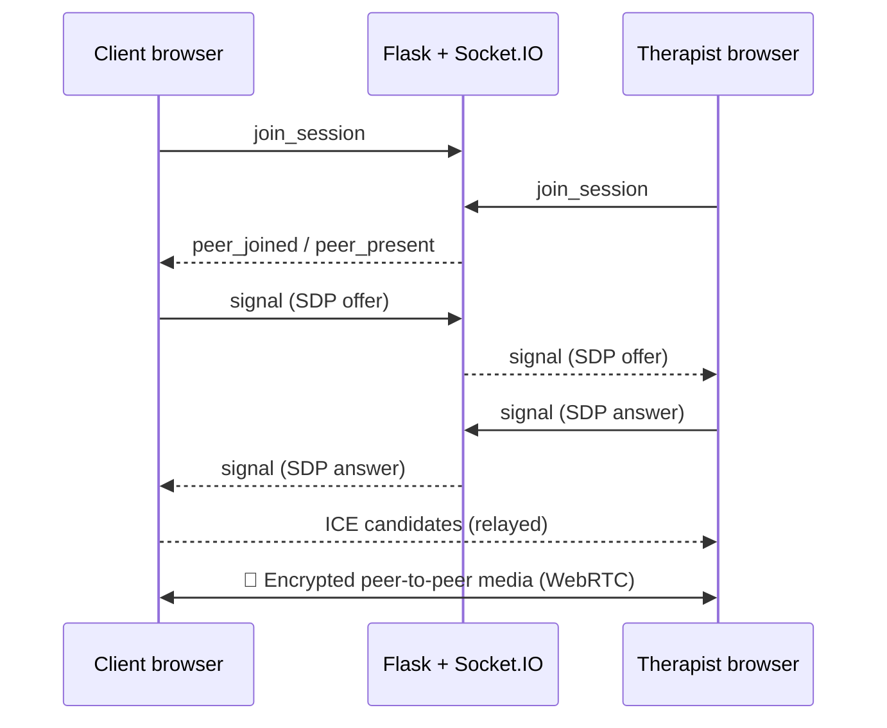

<div align="center">

# 💜 Innovix · SafeVoice

### Professional mental-health support, wherever you are.

A **privacy-first** online therapy platform that connects people with licensed therapists through **video, audio, or text** — with AI used only to help users check in emotionally and prepare, **never to diagnose or replace professional care.**

<br/>

[](https://react.dev/)
[](https://vite.dev/)
[](https://tailwindcss.com/)
[](https://flask.palletsprojects.com/)
[](https://www.postgresql.org/)

[](https://webrtc.org/)
[](https://socket.io/)
[](https://huggingface.co/)
[](https://razorpay.com/)
[](https://docs.pytest.org/)

</div>

---

## 📌 Overview

**SafeVoice** is a full-stack mental-health platform built around three principles:

| Principle                             | What it means                                                                                                  |
| ------------------------------------- | -------------------------------------------------------------------------------------------------------------- |
| 🗣️ **Flexibility of communication**   | Talk to a therapist by video, audio, or text — whichever feels safe for you.                                   |
| 🔒 **Privacy by design**              | Your identity is separated from your therapy at the database level. Privacy is architecture, not a UI promise. |
| 🤝 **AI as support, not replacement** | AI helps you organize your thoughts before a session. It never diagnoses. Humans provide the care.             |

> _"Mental-health support should feel safe to ask for — and structurally safe to receive."_

---

## 🌍 Problem Statement

Many people never reach professional help — not because they don't want it, but because of practical and emotional barriers:

| Challenge                                        | Impact                                                           |
| ------------------------------------------------ | ---------------------------------------------------------------- |
| 🕐 Inflexible clinic hours                       | People with jobs, studies, or caregiving duties can't attend     |
| 😰 Discomfort with face-to-face disclosure       | Many avoid seeking help at all                                   |
| 🔓 Privacy fears around sharing struggles        | Users worry who can see their identity and data                  |
| 📹 Teletherapy that only digitizes the old model | Video-only, full identity exposed, no way to prepare emotionally |

**SafeVoice rethinks the model** instead of just putting it on a screen.

---

## ✨ Features

### 👤 For Clients

| Feature                                | Description                                                                                                                  |
| -------------------------------------- | ---------------------------------------------------------------------------------------------------------------------------- |
| 🔍 **Therapist Discovery**             | Browse verified therapists with real, live availability                                                                      |
| 🧭 **Transparent Matching**            | Every recommendation comes with plain-language reasons — no black-box score                                                  |
| 📅 **Real Booking**                    | Open time slots generated from therapist availability; double-booking is impossible at the database level                    |
| 💳 **Secure Payments**                 | Razorpay with server-side HMAC-SHA256 verification, plus a safe test mode for demos                                          |
| 🎥 **Live Sessions**                   | Peer-to-peer WebRTC video/audio plus real-time text chat                                                                     |
| 🧠 **AI Emotional Check-in**           | Private pre-session check-in that detects likely emotions (anxiety, stress, grief…) with supportive, non-diagnostic language |
| 📓 **Private Journal & Mood Tracking** | Visible only to you — not to therapists, not to admins                                                                       |
| 🌱 **7-Day Recovery Journey**          | Guided plan with progress charts backed by real logged data                                                                  |
| 🛡️ **Women's Safety Hub**              | Private safety planning and trusted-contact storage                                                                          |
| 🎭 **Anonymous Identity**              | Therapists see an anonymous display identity, never your email                                                               |

### 🩺 For Therapists

| Feature                          | Description                                                          |
| -------------------------------- | -------------------------------------------------------------------- |
| 📝 **Apply & Get Verified**      | Admin-reviewed onboarding; unverified therapists can't take bookings |
| 🗓️ **Availability Management**   | Set a weekly schedule; slots are generated automatically             |
| ✅ **Accept / Decline Workflow** | A booking isn't confirmed until you accept it                        |
| 🎥 **Run Sessions**              | Join live video/audio/text rooms                                     |
| 💰 **Earnings Tracking**         | See completed sessions and payouts                                   |

### 🛠️ For Administrators

| Feature                                   | Description                                                                                                                 |
| ----------------------------------------- | --------------------------------------------------------------------------------------------------------------------------- |
| 📊 **Platform Analytics**                 | Users, bookings, payments, and trends                                                                                       |
| ✔️ **Therapist Verification**             | Review and approve applications                                                                                             |
| 💸 **Refund Queue**                       | Declines and late cancellations are queued for admin review                                                                 |
| 🧾 **Audit Logs**                         | Track sensitive administrative actions                                                                                      |
| 📚 **Resource Library**                   | Manage public mental-health resources                                                                                       |
| 🚫 **Structurally Blind to Private Data** | Admins **cannot** access journals, safety plans, check-in text, or session content — verified by an explicit automated test |

---

## 🏗️ System Architecture

```
┌──────────────────────────────────────────────────────────────┐
│                        FRONTEND                              │
│              React  ·  Vite  ·  Tailwind CSS                 │
│                                                              │
│    ┌─────────────┐   ┌──────────────┐   ┌───────────────┐   │
│    │ Client App  │   │ Therapist    │   │ Admin Portal  │   │
│    │             │   │ Portal       │   │               │   │
│    └──────┬──────┘   └──────┬───────┘   └───────┬───────┘   │
└───────────┼─────────────────┼───────────────────┼───────────┘
            │                 │                   │
            └─────────────────┼───────────────────┘
                              │  REST API (httpOnly cookies + CSRF)
                              │  Socket.IO (WebRTC signalling only)
                              ▼
┌──────────────────────────────────────────────────────────────┐
│                     BACKEND (Flask)                          │
│                                                              │
│   ┌──────────────┐  ┌────────────┐  ┌─────────────────────┐ │
│   │  Auth &      │  │ Booking &  │  │  Sessions & Chat    │ │
│   │  Roles (JWT) │  │ Slots      │  │  (WebRTC relay)     │ │
│   └──────────────┘  └────────────┘  └─────────────────────┘ │
│                                                              │
│   ┌──────────────┐  ┌────────────┐  ┌─────────────────────┐ │
│   │  Razorpay    │  │ AI Check-in│  │  Admin & Audit      │ │
│   │  Payments    │  │ (Emotion)  │  │                     │ │
│   └──────────────┘  └────────────┘  └─────────────────────┘ │
└──────────────────────────────────┬───────────────────────────┘
                                   │  SQLAlchemy
                                   ▼
                       ┌─────────────────────┐
                       │ PostgreSQL / SQLite │
                       │  21 tables          │
                       └─────────────────────┘

        🎥 Video/audio flows peer-to-peer between browsers —
           it never touches the server.
```

### 📡 How a live video session connects



The server only relays connection-setup messages between the **two verified participants** of a live session.

---

## 🛠️ Technology Stack

| Layer               | Technology                                                           |
| ------------------- | -------------------------------------------------------------------- |
| **Frontend**        | React, Vite, Tailwind CSS                                            |
| **Backend**         | Python, Flask, SQLAlchemy                                            |
| **Database**        | PostgreSQL (production), SQLite (local)                              |
| **Real-time**       | WebRTC, Socket.IO                                                    |
| **AI**              | Hugging Face Transformers (DistilRoBERTa) for emotion classification |
| **Auth & Security** | JWT in httpOnly cookies, CSRF double-submit protection, bcrypt       |
| **Payments**        | Razorpay with server-side signature verification                     |
| **Testing**         | Pytest — 39 automated tests                                          |
| **DevOps**          | Docker, docker-compose                                               |

---

## 🚀 Getting Started

### Prerequisites

- Python 3.10+
- Node.js 18+ and npm
- Git
- A modern browser (Chrome, Edge, Firefox)

### 1️⃣ Clone the repository

```bash
git clone https://github.com/Nishath2407/Innovix.git
cd Innovix
```

### 2️⃣ Backend (Terminal 1)

```bash
cd backend
python -m venv venv
source venv/bin/activate        # Windows: venv\Scripts\activate
pip install -r requirements.txt
cp .env.example .env            # Windows: copy .env.example .env

flask --app run.py db init      # first-time setup only
flask --app run.py db migrate -m "initial schema"
flask --app run.py db upgrade

python run.py                   # → http://localhost:5000
```

### 3️⃣ Seed sample data (Terminal 2)

```bash
cd backend
python ../scripts/seed_database.py
```

Creates one admin account and **10 verified sample therapists** with real weekly availability, and **prints the login credentials once** — copy them somewhere safe. Running it again is harmless.

### 4️⃣ Frontend (Terminal 3)

```bash
cd frontend
npm install
cp .env.example .env            # Windows: copy .env.example .env
npm run dev                     # → http://localhost:5173
```

### 🐳 Or run everything with Docker

```bash
docker-compose up --build
```

### 🔑 Where to log in

| Portal       | URL                                     |
| ------------ | --------------------------------------- |
| 👤 Client    | `http://localhost:5173/login`           |
| 🩺 Therapist | `http://localhost:5173/therapist/login` |
| 🛠️ Admin     | `http://localhost:5173/admin/login`     |

---

## ⚙️ Configuration

| Variable                                  | Purpose                                                                            |
| ----------------------------------------- | ---------------------------------------------------------------------------------- |
| `PAYMENTS_TEST_MODE`                      | `true` (default locally) uses a no-card test confirmation.                         |
| `RAZORPAY_KEY_ID` / `RAZORPAY_KEY_SECRET` | When set, payments automatically switch to real Razorpay + signature verification. |
| `VITE_API_URL`                            | Frontend → backend URL (default `http://localhost:5000`).                          |

See `backend/.env.example` and `frontend/.env.example` for the full list.

> 💳 **Test vs. live payments:** the switch happens **server-side**. The frontend only asks `/api/payments/config` which mode is active — it can't be flipped from the browser.

---

## 📱 User Flows

### Client Journey

```
Register / Login
      ↓
(Optional) Private AI Emotional Check-in
      ↓
Discover Therapists → See Transparent Match Reasons
      ↓
Pick a Time Slot → Pay (Razorpay / Test Mode)
      ↓
Therapist Accepts the Booking
      ↓
Join Live Session (Video · Audio · Text)
      ↓
Review Therapist · Journal · Track Mood & Recovery
```

### Therapist Journey

```
Apply → Admin Verification
      ↓
Set Weekly Availability
      ↓
Receive Booking Requests → Accept / Decline
      ↓
Run Sessions
      ↓
Track Earnings
```

---

## 🧠 AI — Emotional Check-in (Support, Not Diagnosis)

| ✅ What it does                                                                   | ❌ What it never does                |
| --------------------------------------------------------------------------------- | ------------------------------------ |
| Identifies likely emotional signals (anxiety, stress, grief…) from what you write | Diagnose any condition               |
| Helps you organize your thoughts before a session                                 | Replace a therapist                  |
| Lets you **optionally** share a summary with your therapist                       | Show raw scores to the frontend      |
| Uses internal risk tiers to suggest a supportive next step                        | Share your check-in text with admins |

---

## 🔒 Security & Privacy

- 🔐 Passwords hashed with **bcrypt**; auth tokens in **httpOnly, SameSite cookies** with **CSRF double-submit** protection
- 🎭 **Identity separation** — therapists see an anonymous display identity; authentication lives apart from the therapeutic relationship
- 🛡️ Every protected route checks **valid login → correct role → actual ownership** of the resource
- ⛔ A suspended account's existing session stops working on its **very next request**
- 💳 Razorpay payments verified server-side using **constant-time HMAC comparison** — the frontend's claim of success is never trusted alone
- 🙈 Raw AI risk scores **never leave the server**
- 🚫 Admin endpoints are **proven by test** to be incapable of returning journals, safety plans, or check-in text
- 🗓️ Double-booking is prevented by a **partial unique index** in the database — it holds even under simultaneous requests
- 🗑️ Account deletion **actually erases** private data

---

## 🧪 Testing

```bash
cd backend
pytest tests -v
```

**39 tests** cover: registration/login for all three portals · therapist verification gating · double-booking prevention (including a direct database-constraint test) · the full payment → accept → session → chat → review lifecycle · Razorpay signature verification (valid and invalid) · refund queuing · journal and safety-plan privacy (including after account deletion) · AI risk tiering · admin's inability to see private content · suspended-account session invalidation.

---

## 📁 Project Structure

```
Innovix/
│
├── frontend/                     React app — client, therapist & admin portals
│   ├── src/
│   │   ├── pages/                One file per screen (incl. SessionRoom, dashboards)
│   │   ├── components/           Navbar, BookingModal, ProtectedRoute, StatusPill…
│   │   ├── context/              AuthContext — who's logged in, which portal
│   │   ├── services/             api.js — every backend call
│   │   ├── App.jsx               All routes, grouped by portal
│   │   └── main.jsx
│   └── Dockerfile
│
├── backend/                      Flask API
│   ├── app/
│   │   ├── models/               21 database tables
│   │   ├── auth/                 Registration & portal-based login
│   │   ├── therapists/           Discovery, slot generation, transparent matching
│   │   ├── appointments/         Booking, cancellation, rescheduling, reviews
│   │   ├── sessions/             Session lifecycle + realtime.py (WebRTC signalling)
│   │   ├── chat/                 Session-scoped text messages
│   │   ├── ai/                   Emotion classification + risk tiering
│   │   ├── payments/             Razorpay + test mode
│   │   ├── journal/ · safety/    Private-by-design user content
│   │   ├── wellness/             Progress charts + 7-day recovery
│   │   ├── notifications/        In-app notifications
│   │   ├── admin/                Analytics, management, audit logs
│   │   └── utils/                Auth decorators, mailer, audit logging
│   ├── tests/                    39 tests
│   └── Dockerfile
│
├── scripts/seed_database.py      Admin + 10 verified sample therapists
├── docs/                         architecture · api · privacy · security · deployment
├── docker-compose.yml
└── README.md
```

---

## 🩹 Troubleshooting

<details>
<summary><b>🎥 Video stuck on "Connecting…"</b></summary>

- **One webcam, two browsers:** on Windows a camera is usually locked to one app. Test with two devices, or let one side fall back to audio-only.
- Allow camera and microphone for `localhost` in both browsers.
- Open DevTools → Console and look for lines beginning with `[call]` to see where signalling stops.
- Restrictive networks may need a TURN server (currently only a public STUN server is configured).
</details>

<details>
<summary><b>🚦 Console flooded with 429 / CORS errors</b></summary>

A `429 Too Many Requests` response from the rate limiter also makes the browser report a CORS error on the preflight request. Restart the backend to reset the limiter, and make sure chat polling runs on a slow interval rather than in a tight loop.

</details>

<details>
<summary><b>🔑 Can't log in</b></summary>

Use the credentials printed by `seed_database.py` on the **matching portal** (`/login`, `/therapist/login`, `/admin/login`), and clear old `localhost` cookies if you recently reset the database.

</details>

---

## 🗺️ Roadmap

- [ ] 🌐 **Multi-language support** — Hindi and other regional languages
- [ ] 📱 **Mobile app** — native experience for sessions on the go
- [ ] 🌉 **TURN server support** — reliable video on restrictive networks
- [ ] 🔔 **Email / SMS session reminders**
- [ ] 🏢 **Corporate wellness programs**
- [ ] 🎓 **University counseling services**
- [ ] 🤲 **NGO-backed support initiatives**

---

## 🌟 Vision

To make mental-health support **accessible, flexible, and trustworthy** — by treating privacy and choice as **architectural decisions**, not afterthoughts. Identity separation, non-diagnostic AI, and access-controlled administration are built into the data model itself, so trust doesn't depend on promises.

---

## ⚠️ Important Notice

SafeVoice is **not an emergency service**, and the AI check-in is **not a diagnostic tool**. If you or someone you know is in crisis or in immediate danger, contact your local emergency number right away. In India, you can call **Tele-MANAS at 14416** (toll-free, 24/7).

> The therapists and accounts created by `seed_database.py` are **sample demo data** for development only.

---

## 📄 License

This project is licensed under the **MIT License** — see the [`LICENSE`](LICENSE) file for details.

<div align="center">

**Built with 💜 for people who needed an easier way to ask for help.**

_Safe voices. Private by design. Human-led care._

⭐ **Star this repo if Innovix inspired you!**

</div>
